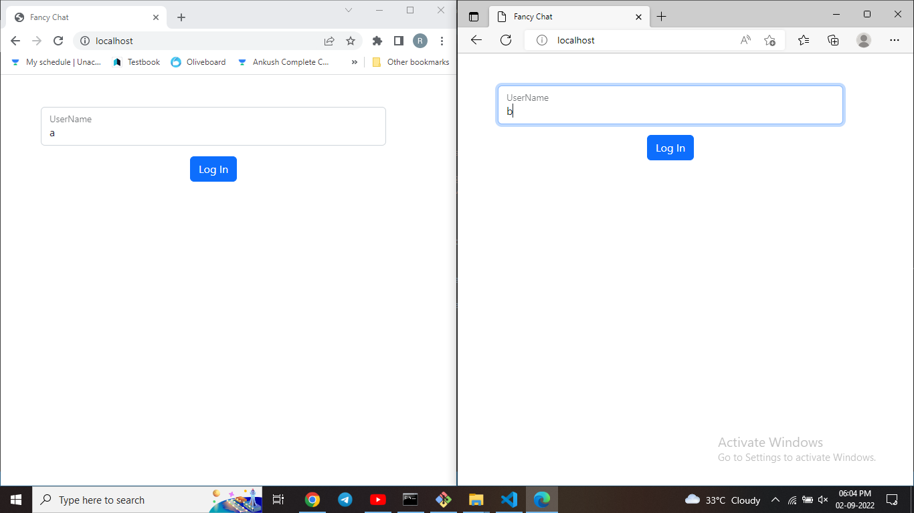

# Relatime Chat Web App

This is a simple relatime chat web app build using nodejs express and socket.io for relatime connectivity

<table>
<tbody>
<tr>
<td><b>Log In View</b></td>
<td></td>
</tr>
<tr>
<td><b>Chat View</b></td>
<td></td>
</tr>
<tr>
<td><b>Chat Navigations</b></td>
<td></td>
</tr>
<tr>
<td><b>Create Room View</b></td>
<td></td>
</tr>
<tr>
<td><b>Chats</b></td>
<td></td>
</tr>
</tbody>
</table>

